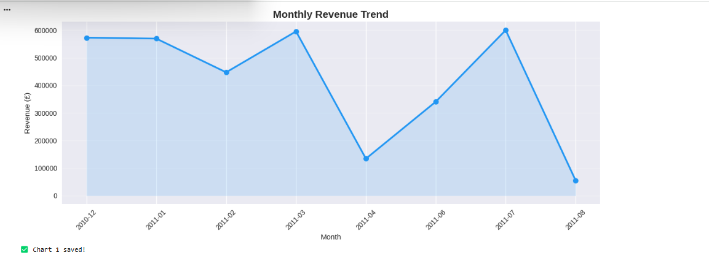
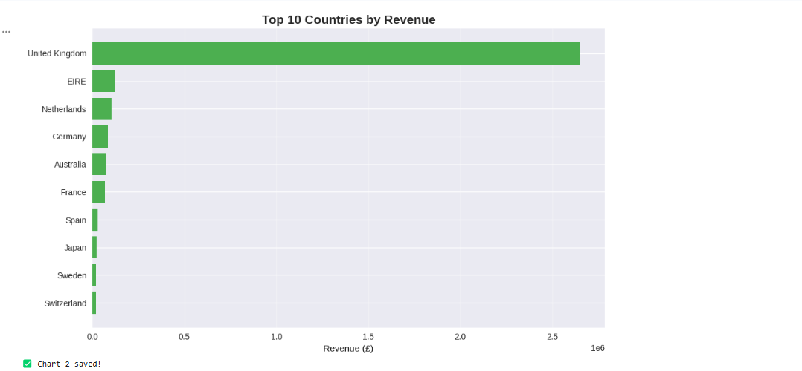
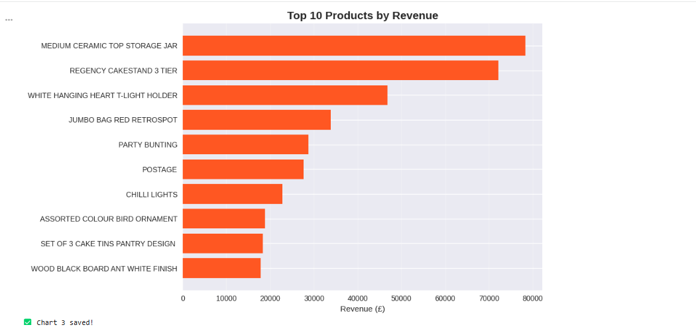
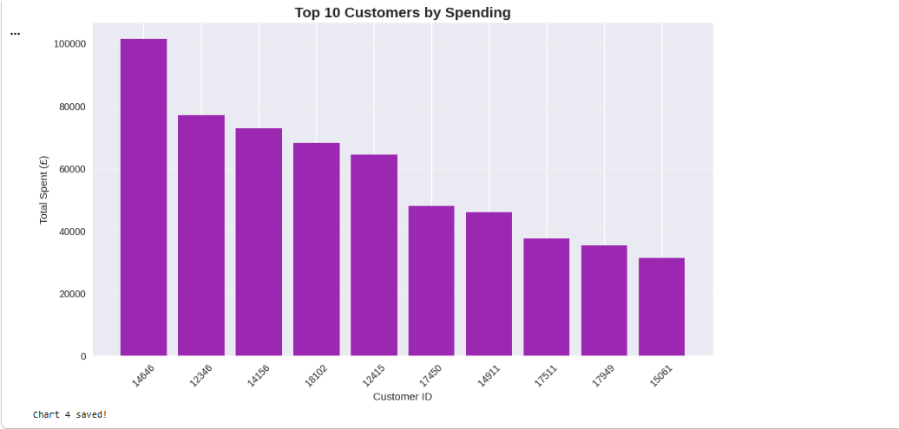

# Ecommerce-sql-analysis
#  E-Commerce Sales Analysis using SQL & Python


##  Project Overview
This project performs an in-depth analysis of an online retail dataset using **SQL queries inside Python**. The goal is to extract meaningful business insights from raw transactional data — covering revenue trends, customer behavior, product performance, and geographic distribution.

The project demonstrates a real-world Data Analyst workflow:
**Data Loading → Cleaning → SQL Database → Querying → Visualization → Insights**

---

##  Objectives
- Analyze overall business performance using SQL aggregate functions
- Identify top revenue-generating countries, products, and customers
- Discover monthly revenue trends and seasonal patterns
- Visualize findings through professional charts
- Derive actionable business recommendations from data

---

##  Dataset Information
| Property | Details |
|----------|---------|
| Source | Kaggle — Online Retail Dataset |
| Total Records | 541,909 rows |
| Columns | 8 |
| Time Period | December 2010 — August 2011 |
| Region | Primarily United Kingdom |

---

##  Tools & Technologies
| Tool | Purpose |
|------|---------|
| Python | Core programming language |
| Pandas | Data manipulation and cleaning |
| SQLite3 | In-memory SQL database and querying |
| Matplotlib | Data visualization |
| Seaborn | Statistical visualizations |
| Google Colab | Development environment |
| GitHub | Version control and portfolio |

---

##  Data Cleaning Steps
- Removed rows with missing **CustomerID** — not useful for customer analysis
- Filtered out **negative quantities** — returned orders excluded
- Removed **zero unit prices** — invalid transactions
- Created **TotalPrice** column — Quantity × UnitPrice
- Converted **InvoiceDate** to datetime format
- Extracted **Month** and **Year** columns for trend analysis

---

##  SQL Queries Performed
```sql
-- Business Overview
SELECT COUNT(DISTINCT InvoiceNo), COUNT(DISTINCT CustomerID),
       ROUND(SUM(TotalPrice), 2), ROUND(AVG(TotalPrice), 2)
FROM sales

-- Top 10 Countries by Revenue
SELECT Country, COUNT(DISTINCT InvoiceNo), ROUND(SUM(TotalPrice), 2)
FROM sales GROUP BY Country ORDER BY revenue DESC LIMIT 10

-- Top 10 Products by Revenue
SELECT Description, SUM(Quantity), ROUND(SUM(TotalPrice), 2)
FROM sales GROUP BY Description ORDER BY revenue DESC LIMIT 10

-- Top 10 Customers by Spending
SELECT CustomerID, COUNT(DISTINCT InvoiceNo), ROUND(SUM(TotalPrice), 2)
FROM sales GROUP BY CustomerID ORDER BY total_spent DESC LIMIT 10

-- Monthly Revenue Trend
SELECT Month, COUNT(DISTINCT InvoiceNo), ROUND(SUM(TotalPrice), 2)
FROM sales GROUP BY Month ORDER BY Month
```

---

##  Visualizations

###  Monthly Revenue Trend


###  Top 10 Countries by Revenue


###  Top 10 Products by Revenue


###  Top 10 Customers by Spending


---

##  Key Findings & Business Insights

###  Revenue Overview
| Metric | Value |
|--------|-------|
| Total Revenue | £3,315,208 |
| Total Orders | 7,240 |
| Unique Customers | 2,726 |
| Average Order Value | £22.8 |

###  Geographic Insights
- **United Kingdom dominates** — 80% of total revenue from UK alone
- **Ireland and Netherlands** are strong secondary markets
- **Australia in top 5** — international demand exists beyond Europe
- Over-dependence on UK is a **business risk** — diversification needed

###  Time-Based Insights
- **July 2011** was the peak month — £600,089 revenue
- **December 2010** showed strong holiday shopping — £572,705
- **April 2011** was the slowest month — only £134,021
- Seasonal patterns are clearly visible — inventory planning needed

###  Product Insights
- **MEDIUM CERAMIC TOP STORAGE JAR** — best seller with 75,189 units and £78,310 revenue
- **REGENCY CAKESTAND** — premium product with high price per unit
- **Home decoration and kitchen items** dominate top 10 products
- Focus should be on expanding this product category

###  Customer Insights
- **Customer 14646** — most valuable — £101,504 in 22 orders
- **Customer 12346** — £77,183 in just 1 single order
- **Top 10 customers** contribute **19% of total revenue**
- Retention of top customers is critical for business survival

---

##  Business Recommendations
1. **Reduce UK dependency** — invest in marketing for Germany, France, Australia
2. **Stock up before July and December** — peak revenue months
3. **Launch promotions in April** — slowest sales month
4. **Create VIP loyalty program** for top 10 customers
5. **Expand home decoration category** — highest performing product type
6. **Investigate August 2011 drop** — data may be incomplete

---

##  How to Run
1. Clone this repository
2. Open `Ecommerce_SQL_Analysis.ipynb` in Google Colab
3. Upload `data.csv` to Colab files
4. Run all cells in order

---

##  Author
**Raffia Pervez** — BS Computer Science Student | Aspiring Data Analyst

[](https://github.com/Raffia-T17)
